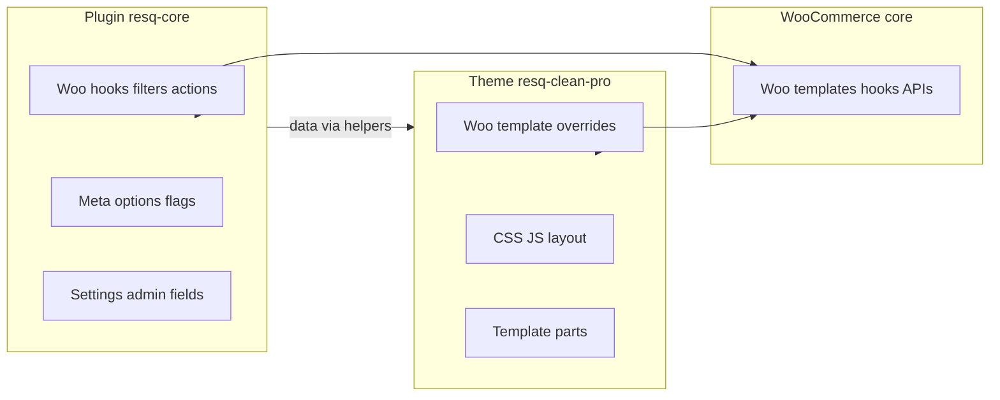

# 01 — Theme / Plugin Contract

> Defines **what belongs where**. Agents must not blur this boundary without updating this doc and the Woo template map (`03-WOO-TEMPLATE-MAP.md`).

## Summary

| Layer | Slug | Role |
|---|---|---|
| Theme | `resq-clean-pro` | HTML structure, CSS/JS, Woo template overrides, layout |
| Plugin | `resq-core` | Data, settings, Woo hooks, integrations, admin UI |

**Rule of thumb:** If it renders markup for a page surface, it lives in the theme. If it decides *what* to show or *how* commerce behaves, it lives in the plugin.

---

## Theme: `resq-clean-pro`

### Owns

- Templates and template parts (including Woo overrides under `woocommerce/`)
- Global layout: header, footer, navigation shell, page wrappers
- CSS, JS, fonts, images (built assets)
- Block patterns / block styles (if added later — not baseline)
- Presentational filters only (format output, add CSS classes — not business rules)
- Template parts for plugin-provided data (badges, FBT blocks, compliance notice slots)

### Must not own

- Custom post types, taxonomies, or product meta registration
- Checkout/cart logic, pricing rules, coupon behavior, tax calculations
- Admin settings pages or REST endpoints (except theme customizer display-only settings)
- Third-party API credentials or webhook handlers
- Feature flags or option storage
- Email content logic (plugin); theme may style transactional emails via Woo email templates

---

## Plugin: `resq-core`

### Owns

- Custom post types, taxonomies, product meta, admin fields
- WooCommerce hooks: cart, checkout, account, emails (logic side)
- Settings API, options, feature flags
- Integrations (CRM, analytics, shipping helpers) — when added
- Shortcodes/blocks that require server-side logic
- Data providers for merchandising (badges, cross-sells, FBT product sets)
- Compliance logic (age gate rules, disclaimer content sources — theme renders)

### Must not own

- Page layout and visual design (delegate markup classes to theme)
- Hard-coded colors/typography (consume theme tokens via CSS variables or filters)
- Full Woo template overrides (except email template hooks that inject data)

---

## Namespace and prefix conventions

| Context | Convention | Example |
|---|---|---|
| Plugin functions (global) | `resq_core_*` | `resq_core_get_option()` |
| Theme functions (global) | `resq_theme_*` | `resq_theme_get_asset_url()` |
| Plugin classes | PSR-4 `ResQ\Core\` | `ResQ\Core\Settings\Options` |
| Theme classes | `ResQ_Clean_Pro\` | `ResQ_Clean_Pro\Assets\Enqueue` |
| Plugin hooks (filters/actions) | `resq_core_*` | `resq_core_feature_enabled` |
| Theme hooks | `resq_theme_*` | `resq_theme_before_product_card` |
| Option keys | `resq_core_*` | `resq_core_features` |
| Post meta keys | `_resq_*` | `_resq_badge_label` |
| Transients | `resq_core_*` | `resq_core_fbt_{product_id}` |
| Text domains | `resq-core` / `resq-clean-pro` | — |

Pick one class style per layer and do not mix prefixes within that layer.

---

## Required helper functions

These functions form the **public API** between layers. Theme code may call plugin helpers; plugin code must not call theme helpers.

### Plugin helpers (must exist by Phase 2 exit)

| Function | Purpose | Returns |
|---|---|---|
| `resq_core()` | Singleton/bootstrap accessor | Plugin instance or service container |
| `resq_core_get_option( string $key, mixed $default = null )` | Read plugin option with default | mixed |
| `resq_core_feature_enabled( string $feature )` | Check feature flag | bool |
| `resq_core_get_badge_data( int $product_id )` | Badge label, type, priority for PLP/PDP | `array\|null` |
| `resq_core_get_cross_sells( int $product_id )` | Curated cross-sell product IDs | `int[]` |
| `resq_core_get_fbt_products( int $product_id )` | Frequently-bought-together set | `int[]` |
| `resq_core_get_compliance_notices( string $context )` | Notices for context (`pdp`, `checkout`, `cbd`, etc.) | `array[]` |
| `resq_core_is_active()` | Whether plugin bootstrap completed | bool |

Filter hooks wrap each data helper where customization is expected:

- `resq_core_badge_data`
- `resq_core_cross_sells`
- `resq_core_fbt_products`
- `resq_core_compliance_notices`

### Theme helpers (must exist by Phase 3 exit)

| Function | Purpose | Returns |
|---|---|---|
| `resq_theme_get_asset_url( string $path )` | Versioned asset URL | string |
| `resq_theme_template_part( string $slug, string $name = '', array $args = [] )` | Load template part with args | void |
| `resq_theme_class( string $base, array $modifiers = [] )` | BEM-style class string builder | string |
| `resq_theme_render_badge( int $product_id )` | Render badge markup from plugin data | void |
| `resq_theme_render_compliance_notices( string $context )` | Render notice slot for context | void |
| `resq_theme_wc_active()` | Whether WooCommerce is active | bool |

Theme helpers that consume plugin data **must** guard with `function_exists( 'resq_core_get_badge_data' )` or `resq_core_is_active()`.

---

## Fallback behavior

### Theme active, plugin deactivated

| Area | Expected behavior |
|---|---|
| Front-end | No PHP fatals; layouts render with reduced features |
| Badges / FBT / cross-sells | Hidden or empty; no broken markup |
| Compliance notices | Theme may show static fallback copy from theme mod (optional); no CBD-specific logic |
| Woo templates | Standard Woo output; theme overrides still load |
| Admin | No ResQ settings pages; Woo native admin only |

Implementation rule: every theme call to `resq_core_*` is wrapped in `function_exists()` or `resq_core_is_active()`.

### Plugin active, theme switched to default/other

| Area | Expected behavior |
|---|---|
| Data layer | Options, meta, CPTs remain intact |
| Admin | Plugin settings pages still accessible |
| Front-end hooks | Plugin registers hooks; if theme does not render slots, data is simply unused |
| Woo logic | Cart/checkout/account hooks still fire where theme exposes standard Woo hooks |
| No dependency on theme constants | Plugin must not `require` theme files |

Implementation rule: plugin never assumes `resq-clean-pro` is active. Use `get_template()` checks only for optional enhancements, never for required logic.

### WooCommerce deactivated

| Layer | Expected behavior |
|---|---|
| Theme | Falls back to standard WP templates; no Woo-specific fatals |
| Plugin | Admin notice: WooCommerce required; front-end Woo hooks not registered |

---

## Metadata ownership

All keys use plugin registration. Theme reads via helpers; theme must not `update_post_meta` for plugin-owned keys.

### Options (wp_options)

| Option key | Owner | Purpose | Default phase |
|---|---|---|---|
| `resq_core_version` | plugin | Schema/version tracking | Phase 2 |
| `resq_core_features` | plugin | Feature flag map | Phase 2 |
| `resq_core_settings` | plugin | General settings blob | Phase 2 |
| `resq_core_compliance` | plugin | Compliance copy sources, toggles | Phase 4+ |

### Post meta (products)

| Meta key | Owner | Purpose | Consumer |
|---|---|---|---|
| `_resq_badge_label` | plugin | Custom badge text | theme card, PDP |
| `_resq_badge_type` | plugin | Badge variant slug | theme CSS class |
| `_resq_featured_collection` | plugin | Collection grouping | homepage, PLP filters |
| `_resq_fbt_product_ids` | plugin | Manual FBT override | PDP FBT block |
| `_resq_compliance_flags` | plugin | Product-level compliance tags | PDP, checkout |

Standard Woo meta (`_price`, `_stock`, etc.) remains Woo-owned.

### Term meta (categories)

| Meta key | Owner | Purpose |
|---|---|---|
| `_resq_category_hero_image` | plugin | Category hero asset ID |
| `_resq_category_intro` | plugin | Category intro copy |
| `_resq_compliance_category` | plugin | e.g. `cbd` flag for notice injection |

### Transients

| Transient pattern | Owner | TTL | Purpose |
|---|---|---|---|
| `resq_core_fbt_{product_id}` | plugin | 12h | Cached FBT computation |
| `resq_core_cross_sell_{product_id}` | plugin | 12h | Cached cross-sell rules |

Transients cleared on plugin deactivation. Options and post meta are **not** deleted on deactivation.

---

## WooCommerce integration boundaries



| Concern | Owner | Mechanism |
|---|---|---|
| PLP/PDP/cart/checkout HTML structure | theme | Template overrides in `woocommerce/` |
| Product card markup | theme | `content-product.php` + template parts |
| Price display formatting | plugin | `woocommerce_get_price_html` filter |
| Cart notices (logic) | plugin | `woocommerce_add_to_cart` hooks |
| Cart notice styling | theme | CSS classes on notice wrappers |
| Checkout field add/remove | plugin | `woocommerce_checkout_fields` filter |
| Checkout field layout | theme | `form-checkout.php` structure |
| Custom product tabs (content) | plugin | `woocommerce_product_tabs` filter |
| Custom product tabs (style) | theme | Tab template / CSS |
| Related / upsell product IDs | Woo + plugin rules | Plugin may filter `woocommerce_output_related_products_args` |
| Related / upsell rendering | theme | Template or hooked template part |
| Bundle product display | shared | Plugin: bundle data/rules; theme: bundle template part |
| FBT block | shared | Plugin: `resq_core_get_fbt_products()`; theme: renders block |
| Compliance notices | shared | Plugin: content + rules; theme: render slots |
| Transactional emails (content) | plugin | Woo email hooks |
| Transactional emails (HTML shell) | theme | Optional `woocommerce/emails/` overrides |
| Account endpoint logic | plugin | Endpoint registration if custom |
| Account endpoint templates | theme | `myaccount/*.php` |

**Boundary line:** Plugin stops at data and hook callbacks. Theme starts at template files and template parts. When both touch a surface, plugin returns arrays/objects; theme renders HTML.

---

## Activation and deactivation expectations

### Plugin: `resq-core`

**On activation:**

1. Set default options (`resq_core_features`, `resq_core_settings`) if missing
2. Store `resq_core_version`
3. Register any CPTs/taxonomies (when introduced)
4. Flush rewrite rules (deferred via `flush_rewrite_rules` on next load)
5. No front-end output during activation

**On deactivation:**

1. Clear plugin transients (`resq_core_*`)
2. Unschedule any plugin cron events
3. **Do not** delete options, post meta, or user data
4. Admin may show notice if theme expects plugin features

**On uninstall (future, if implemented):**

- Separate `uninstall.php` required for any data deletion
- Uninstall must never run automatically on deactivation

### Theme: `resq-clean-pro`

**On activation (`after_switch_theme`):**

1. Register nav menu locations (primary, footer — when implemented)
2. Set theme mods defaults if using Customizer
3. **Do not** create plugin options or product data

**On switch away:**

1. Theme mods for this theme are preserved in DB but inactive
2. Plugin data remains; only presentation changes

---

## Communication between layers

| Need | Pattern |
|---|---|
| Theme needs a setting | Plugin exposes `resq_core_get_option()` or localized script data via `wp_localize_script` |
| Plugin needs markup | Plugin returns data; theme renders via `resq_theme_template_part()` |
| Shared strings (logic) | Plugin i18n domain `resq-core` |
| Shared strings (display-only) | Theme domain `resq-clean-pro` |
| Feature toggle | Plugin option + filter `resq_core_feature_enabled` |
| New product field | Plugin registers meta + admin UI; theme reads via helper |
| New template slot | Theme adds template part; document in template map; plugin optionally supplies data |

### Anti-patterns (do not do)

- Plugin echoing HTML in Woo hooks without theme template part
- Theme calling `update_option( 'resq_core_*' )`
- Theme registering product meta boxes
- Plugin enqueueing theme CSS files
- Either layer hard-coding hex colors outside brand tokens

---

## File naming and structure

### Theme

```text
resq-clean-pro/
  style.css
  functions.php
  index.php
  header.php, footer.php          # Phase 3
  template-parts/                 # Phase 3+
  woocommerce/                    # Phase 4 — mirrors Woo hierarchy
  assets/css/, assets/js/         # Phase 3+
```

Woo overrides mirror Woo template paths exactly (see `03-WOO-TEMPLATE-MAP.md`).

### Plugin

```text
resq-core/
  resq-core.php                   # Bootstrap only
  includes/                       # WordPress-style or PSR-4 autoload
    class-plugin.php
    settings/
    woocommerce/
    admin/
  languages/
```

One concern per class file. Bootstrap file stays thin.

---

## Change checklist

Before merging theme or plugin changes:

- [ ] Does this violate the contract above?
- [ ] Is the sibling layer updated (theme markup for new plugin data, or vice versa)?
- [ ] Are new helpers documented in this file?
- [ ] Are new meta keys / options added to the metadata table?
- [ ] Woo template map (`03-WOO-TEMPLATE-MAP.md`) updated if templates moved or added?
- [ ] Fallback behavior tested when sibling layer is inactive?
