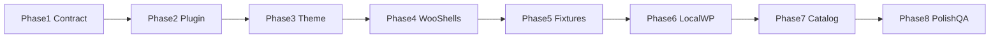

# 06 — Build Roadmap

> Ordered phased delivery for the ResQ Foundation Kit. Each phase has entry criteria, key tasks, and exit criteria. Do not skip verification gates.

## Overview



| Phase | Name | Primary output |
|---|---|---|
| 0 | Skeleton | Repo, docs scaffold, agent skills *(complete)* |
| 1 | Contract and architecture | Locked docs 00–06, namespace, boundaries |
| 2 | Plugin foundation | `resq-core` bootstrap, settings, helpers |
| 3 | Theme foundation | `resq-clean-pro` layout, assets, tokens shell |
| 4 | WooCommerce template shells | All mapped template overrides (minimal markup) |
| 5 | Demo fixtures | Sample categories/products via WP-CLI |
| 6 | LocalWP install test | End-to-end smoke on fresh WP + Woo |
| 7 | Catalog / product strategy | Merchandising rules, badges, cross-sells |
| 8 | Polish and QA | Taste, compliance, accessibility, preflight |

---

## Phase 0 — Skeleton *(current baseline)*

**Status:** largely complete

- [x] Repo structure, docs scaffold, agent skills
- [x] Minimal theme and plugin bootstrap files
- [ ] CodeGraph installed and indexed locally (per developer)

---

## Phase 1 — Contract and architecture

**Goal:** Lock planning docs so every future Codex task has a clear, safe contract.

### Entry criteria

- Phase 0 repo skeleton exists
- Theme and plugin scaffolds activate without fatals

### Key tasks

| Task | Owner doc | Notes |
|---|---|---|
| Finalize `00-PROJECT-BRIEF.md` | 00 | Mission, boundaries, audiences, decisions |
| Finalize `01-THEME-PLUGIN-CONTRACT.md` | 01 | Helpers, fallbacks, meta ownership |
| Finalize `03-WOO-TEMPLATE-MAP.md` | 03 | All storefront surfaces mapped |
| Finalize `06-BUILD-ROADMAP.md` | 06 | This document |
| Align `AGENTS.md` with docs | AGENTS | Point to docs; no duplication |
| Confirm namespace conventions | 01 | `resq_core_*`, `resq_theme_*`, `ResQ\Core\` |
| Asset build decision | 00 / 01 | Default: plain CSS/JS; Vite optional note for Phase 3 |
| Review 02, 04, 05 for consistency | 02–05 | No full fill required; ensure no contradictions |

### Exit criteria

- [ ] Docs 00, 01, 03, 06 internally consistent
- [ ] No TBD markers in contract-critical sections (helpers, surfaces, phases)
- [ ] `AGENTS.md` read order matches doc set
- [ ] Git commit: `docs: define ResQ foundation architecture and roadmap`
- [ ] Team/agent sign-off: contract is safe to implement against

### Verification gate

- Cross-read 01 vs 03: every shared surface has owner + helper named
- Cross-read 00 vs 06: phase scope matches project boundaries

---

## Phase 2 — Plugin foundation

**Goal:** `resq-core` becomes a functional logic layer with settings, feature flags, and public helpers.

### Entry criteria

- Phase 1 exit criteria met

### Key tasks

| Task | Effort | Notes |
|---|---|---|
| PSR-4 or structured autoloader | Low | `includes/` layout per contract |
| Activation / deactivation hooks | Low | Defaults, transient cleanup |
| Settings API + options defaults | Medium | `resq_core_settings`, `resq_core_features` |
| Implement required helpers (stubs OK) | Medium | See `01-THEME-PLUGIN-CONTRACT.md` |
| Woo dependency check + admin notice | Low | Require WooCommerce active |
| Feature flag infrastructure | Low | `resq_core_feature_enabled()` |
| WP-CLI command scaffold | Low | `wp resq-core status` |
| i18n load | Low | `resq-core` text domain |

### Exit criteria

- [ ] Plugin activates/deactivates without errors
- [ ] All documented `resq_core_*` helpers exist (may return empty/stub data)
- [ ] Settings page accessible in admin (minimal UI OK)
- [ ] `wp resq-core status` reports version and feature flags
- [ ] Deactivation clears transients; options preserved
- [ ] No HTML echoed from plugin on front-end hooks yet

### Verification gate

- Deactivate plugin: no fatals in theme
- Reactivate: defaults restored where missing

---

## Phase 3 — Theme foundation

**Goal:** `resq-clean-pro` provides global layout, asset loading, and CSS token shell.

### Entry criteria

- Phase 2 exit criteria met (helpers available for guarded calls)

### Key tasks

| Task | Effort | Notes |
|---|---|---|
| Template hierarchy: header, footer, index | Medium | Mobile-first shell |
| Nav menu locations (primary, footer) | Low | Registered on theme switch |
| Enqueue system for CSS/JS | Low | Versioned with `RESQ_THEME_VERSION` |
| CSS custom properties (token shell) | Low | Align with `02-BRAND-FOUNDATION.md` structure |
| Basic responsive grid / container | Low | Used by later Woo templates |
| Implement `resq_theme_*` helpers | Medium | Per contract doc |
| Woo support declaration | Low | `add_theme_support( 'woocommerce' )` |
| Plugin guard pattern in template parts | Low | `function_exists( 'resq_core_is_active' )` |

### Exit criteria

- [ ] Theme activates without fatals with or without plugin
- [ ] Header/footer render on home and a sample page
- [ ] CSS variables loaded; no hard-coded brand hex in plugin
- [ ] All documented `resq_theme_*` helpers exist
- [ ] Woo gallery support enabled if needed

### Verification gate

- Theme Customizer / front page loads
- Plugin deactivated: layout intact, badges hidden

---

## Phase 4 — WooCommerce template shells

**Goal:** Create override files for every surface in `03-WOO-TEMPLATE-MAP.md` with minimal markup and correct hooks.

### Entry criteria

- Phase 3 exit criteria met
- WooCommerce active in sandbox

### Key tasks

| Task | Effort | Notes |
|---|---|---|
| `archive-product.php` | Medium | Shop + category shared |
| `content-product.php` | Medium | Card anatomy + badge slot |
| `single-product.php` + partials | Medium | PDP zones, compliance slot |
| Cart templates | Medium | cart.php, cart-empty.php |
| Checkout `form-checkout.php` | Medium | Compliance banner slot |
| My Account shell | Low | navigation + dashboard |
| `search.php` | Low | Product-first results |
| Template parts: compliance, FBT | Low | Empty-safe when no data |
| Document any new partials in template map | Low | Same PR |

**Explicitly out of scope for Phase 4:** visual polish, final copy, real merchandising rules.

### Exit criteria

- [ ] Every `planned` row in template map has a theme file or documented hook strategy
- [ ] PLP, PDP, cart, checkout, account, search load without PHP notices
- [ ] Compliance and FBT slots render empty gracefully
- [ ] Plugin hooks fire (verify with simple test notice in plugin)
- [ ] Template map status updated to `in-progress` or `done` per file

### Verification gate

Smoke URLs (no styling judgment):

- `/shop/` · `/product-category/{slug}/` · `/product/{slug}/`
- `/cart/` · `/checkout/` · `/my-account/` · `/?s=test&post_type=product`

---

## Phase 5 — Demo fixtures

**Goal:** Repeatable demo catalog for local development without real product data.

### Entry criteria

- Phase 4 exit criteria met

### Key tasks

| Task | Effort | Notes |
|---|---|---|
| WP-CLI import script in `scripts/` | Medium | Idempotent where possible |
| Top-level categories | Low | Pets, People, CBD, Bundles, Learn — labels only |
| Placeholder simple products per category | Medium | Generic titles, no real SKUs/pricing strategy |
| Sample pages (Home, Learn index) | Low | Block or classic content |
| Menu assignment | Low | Primary nav to categories |
| Fixture README | Low | How to import/reset |

**Rules:**

- No production catalog copy or images
- No real customer PII in fixtures
- CBD products flagged with compliance meta for testing notices only

### Exit criteria

- [ ] `scripts/import-fixtures.sh` (or `.ps1`) runs cleanly on fresh install
- [ ] Five planning categories exist with ≥1 product each
- [ ] Navigation resolves to category archives
- [ ] At least one product has badge meta + FBT meta for UI testing
- [ ] Fixtures gitignored if they contain generated SQL with env-specific URLs

### Verification gate

- Re-run import on clean DB: consistent result
- `wp db export` before import documented in script header

---

## Phase 6 — LocalWP install test

**Goal:** Prove the foundation kit installs and runs on a fresh LocalWP (or equivalent) environment.

### Entry criteria

- Phase 5 exit criteria met

### Key tasks

| Task | Effort | Notes |
|---|---|---|
| Fresh LocalWP site: WP + WooCommerce | Medium | Standard WP, not Bedrock |
| Clone/copy theme + plugin into `wp-content` | Low | Or symlink for dev |
| Activate theme + plugin | Low | |
| Run fixture import | Low | |
| Configure test payment (Cash on Delivery or Stripe test) | Low | No live keys |
| Deactivate outbound email / live payment plugins | Low | Per compliance doc |
| Full smoke test checklist | Medium | All template map surfaces |
| Document local setup in script or README snippet | Low | |

### Exit criteria

- [ ] Clean install → active theme/plugin → fixtures → smoke pass
- [ ] Add to cart → checkout start works in test mode
- [ ] Plugin deactivate/activate cycle passes
- [ ] No critical JS console errors on PLP, PDP, checkout
- [ ] `WP_ENVIRONMENT_TYPE` local; debug log reviewed

### Verification gate

| Step | Pass |
|---|---|
| Home loads | |
| Shop archive loads | |
| Category archive loads | |
| PDP loads + add to cart | |
| Cart updates | |
| Checkout form renders | |
| My Account login/register renders | |
| Product search returns results | |
| Compliance slot visible on flagged product (if meta set) | |

---

## Phase 7 — Catalog / product strategy

**Goal:** Define and implement merchandising behavior — badges, sorts, cross-sells, FBT rules, bundle approach.

### Entry criteria

- Phase 6 exit criteria met
- `04-PRODUCT-MERCHANDISING-SYSTEM.md` updated in same phase

### Key tasks

| Task | Effort | Notes |
|---|---|---|
| Fill merchandising doc (04) | Medium | PLP/PDP decisions |
| Badge rules implementation | Medium | Plugin logic + admin fields |
| PLP default sort / filters | Medium | Plugin query filters |
| Cross-sell rules | Medium | `resq_core_get_cross_sells()` |
| FBT rules (manual + fallback) | Medium | Order meta optional later |
| Bundle approach decision | Medium | Extension vs custom — document ADR |
| Related products args | Low | Filter hook |
| Homepage merchandising zones | Medium | Template parts + data sources |

### Exit criteria

- [ ] `04-PRODUCT-MERCHANDISING-SYSTEM.md` complete (no critical TBDs)
- [ ] Badge, cross-sell, FBT helpers return real data for fixture products
- [ ] Bundle strategy documented even if not fully implemented
- [ ] Category strategy respects five planning top-level concepts only

### Verification gate

- Merchandising spot-check on fixture catalog
- **woo-merchandiser** agent review optional

---

## Phase 8 — Polish and QA

**Goal:** Production-ready quality pass — UI, accessibility, compliance, performance.

### Entry criteria

- Phase 7 exit criteria met
- Brand tokens populated in `02-BRAND-FOUNDATION.md` (minimum viable palette/type)

### Key tasks

| Task | Effort | Notes |
|---|---|---|
| Taste-guided UI pass | Medium | **ecommerce-taste-review** skill |
| Compliance review | Medium | **compliance-reviewer** agent; checkout/account |
| Accessibility audit | Medium | WCAG 2.2 AA checklist in doc 05 |
| Performance measurement | Medium | LCP targets per template in doc 05 |
| Sticky ATC, related.php polish | Low | Optional |
| Run **preflight-package-check** | Low | Pre-merge/release |
| CodeGraph re-index | Low | Final structure |

### Exit criteria

- [ ] Compliance reviewer sign-off on checkout/account/compliance surfaces
- [ ] Accessibility checklist in 05 marked for storefront templates
- [ ] Performance budgets documented (even if not fully met — gaps listed)
- [ ] Preflight skill passes
- [ ] Rollback path documented for staging deploy

### Verification gate

1. `wp db export` backup before any staging deploy
2. Build passes (`npm run build` if Vite added)
3. Smoke: home, PLP, PDP, add to cart, checkout start
4. No PHP fatals; no critical JS console errors
5. Plugin/theme version tags updated if releasing

---

## Global verification gates (every phase)

1. **Backup:** `wp db export backups/pre-change.sql` before mutating commands
2. **Branch:** Feature work on branches; contract changes update docs in same PR
3. **Plan mode:** File/DB mutations use plan/review workflow per `AGENTS.md`
4. **Smoke:** After Woo-facing changes — shop, PDP, cart, checkout start minimum
5. **Rollback:** PR describes how to revert (files + DB if applicable)
6. **Sibling layer:** Theme/plugin changes that affect the boundary update both sides

---

## Sandbox commands (reference)

LocalWP, DDEV, or any WP-CLI environment:

```bash
# Backup first
wp db export backups/pre-change.sql

# After copying theme/plugin into wp-content
wp plugin activate resq-core
wp theme activate resq-clean-pro

# Phase 5+ fixtures
# bash scripts/import-fixtures.sh

# Smoke helpers
wp wc product list --format=count
wp option get resq_core_version
```

For DDEV, prefix commands with `ddev` (e.g. `ddev wp plugin activate resq-core`).

---

## Later experiments (post Phase 8)

Only after Phase 8 exit criteria met:

- Understand Anything — onboarding architecture reviews
- Headroom — large log/MCP context compression
- Agent-Reach — competitive/public research (isolated sessions)
- Cherry-picked security skills — checkout hardening audits
- Read/write Woo MCP on staging (never production by default)
- Vite/Sage migration if asset complexity warrants it

---

## Phase status tracker

| Phase | Status | Notes |
|---|---|---|
| 0 Skeleton | complete | |
| 1 Contract | in progress | Step 2 deliverable |
| 2 Plugin foundation | pending | |
| 3 Theme foundation | pending | |
| 4 Woo shells | pending | |
| 5 Fixtures | pending | |
| 6 LocalWP test | pending | |
| 7 Catalog strategy | pending | |
| 8 Polish/QA | pending | |

Update this table at the end of each phase.
