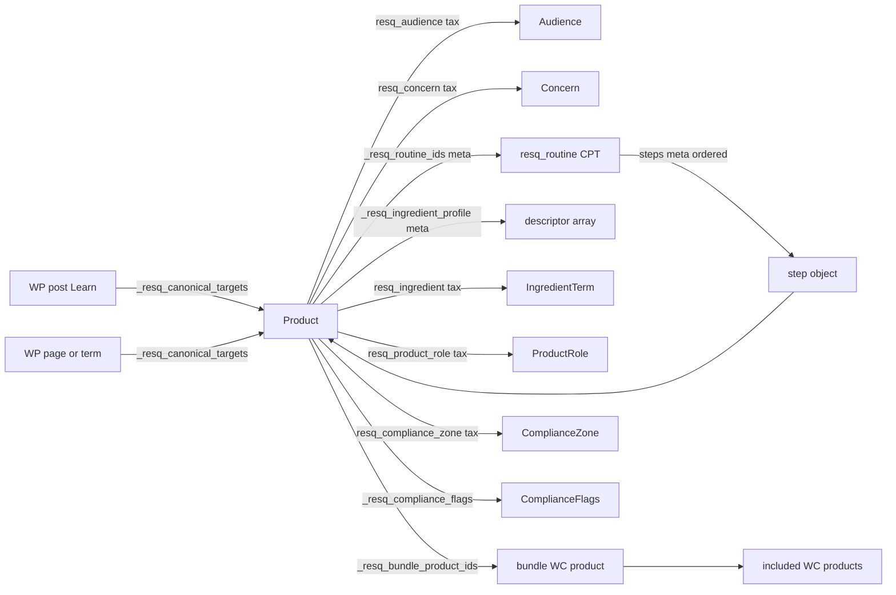

# 11 — Plugin Data Schema

> Plugin-owned data model for `resq-core`. Schema reference — registration and live reads implemented in Phase 3. Delivery record: [`archive/phase-notes/14-PHASE-3-IMPLEMENTATION-NOTES.md`](archive/phase-notes/14-PHASE-3-IMPLEMENTATION-NOTES.md).

## Status

| Item | Value |
|---|---|
| Phase | 2A schema lock — implemented in Phase 3 |
| Implementation | Registered in `wp-content/plugins/resq-core/includes/registrations/`; helpers read live data |
| Implementation record | [`archive/phase-notes/14-PHASE-3-IMPLEMENTATION-NOTES.md`](archive/phase-notes/14-PHASE-3-IMPLEMENTATION-NOTES.md) |
| Source of truth for helpers | `12-PLUGIN-HELPER-CONTRACTS.md` |
| Layer ownership | `01-THEME-PLUGIN-CONTRACT.md` |

## Alignment Notes

Phase 2A resolves three tensions found during the alignment check:

1. **Audience and concern storage:** Native taxonomy assignment is the source of truth. `_resq_audience_ids` and `_resq_concern_ids` are superseded.
2. **Compliance flags:** `_resq_compliance_flags` remains the writable storage array. `_resq_cbd_product` and `_resq_requires_compliance_notice` are helper-derived booleans, not stored meta keys.
3. **Routine steps:** `resq_routine_step` is not a taxonomy. Ordered steps live on the `resq_routine` CPT as serialized meta.

---

## A. Custom Taxonomies

All taxonomies register on the WooCommerce `product` post type unless noted. Final term lists are fixture examples only until Phase 7.

### Summary

| Taxonomy | Decision | Hierarchical | Primary use |
|---|---|---|---|
| `resq_audience` | Registered in Phase 3 | No | Gateway routing, filters |
| `resq_concern` | Registered in Phase 3 | Yes | Problem-led discovery, filters |
| `resq_routine` | **Do not register** | — | Use `resq_routine` CPT instead |
| `resq_routine_step` | **Do not register** | — | Use ordered CPT meta instead |
| `resq_ingredient` | Registered in Phase 3 | No | Ingredient filter, Learn bridges |
| `resq_product_role` | Registered in Phase 3 | No | Routine role hints, shelf grouping |
| `resq_compliance_zone` | Registered in Phase 3 | No | Structural CBD/compliance isolation |

---

### `resq_audience`

| Field | Value |
|---|---|
| Machine name | `resq_audience` |
| Public label | Audiences |
| Slug | `audience` |
| Assigned object type | `product` |
| Hierarchical | No |
| Intended terms (examples) | `human`, `pet` |
| Who edits it | Shop manager / admin via product editor |
| Admin location | Product editor sidebar (taxonomy panel) |
| Frontend use | Gateway pages, product cards, PLP filters |
| Affects product filtering | Yes |
| Affects compliance logic | Indirectly — audience boundaries inform cross-sell rules |
| REST later | Yes — read-only term exposure |

**Notes:** Planning-level nav concepts (CBD, Bundles, Learn) are routes or page types, not audience taxonomy terms. CBD products still use `resq_compliance_zone`, not a separate audience term.

---

### `resq_concern`

| Field | Value |
|---|---|
| Machine name | `resq_concern` |
| Public label | Concerns |
| Slug | `concern` |
| Assigned object type | `product` |
| Hierarchical | Yes |
| Intended terms (examples) | Parent: `pet-topical`, `human-skincare`; child: `hot-spots`, `dry-skin`, `scalp-care` |
| Who edits it | Shop manager / admin |
| Admin location | Product editor sidebar |
| Frontend use | Concern landing pages, filters, PDP labels |
| Affects product filtering | Yes |
| Affects compliance logic | Indirectly — concern copy must stay claim-safe per `05-COMPLIANCE-RULES.md` |
| REST later | Yes — read-only term exposure |

**Notes:** Concerns describe shopper intent, not inventory. One canonical product may map to multiple concern terms.

---

### `resq_routine` (evaluated — not a taxonomy)

| Field | Value |
|---|---|
| Decision | **Do not register as taxonomy** |
| Reason | Routines require ordered steps, product targets, optional bundle targets, and compliance restrictions. Taxonomies cannot store order or per-step product IDs cleanly. |
| Alternative | `resq_routine` custom post type (see Section B) |

---

### `resq_routine_step` (evaluated — not a taxonomy)

| Field | Value |
|---|---|
| Decision | **Do not register as taxonomy** |
| Reason | Steps are ordered, scoped to a parent routine, and reference canonical product IDs. |
| Alternative | Ordered array stored in `_resq_routine_steps` meta on the `resq_routine` CPT |

Example step shape:

```php
[
    'order'       => 1,
    'title'       => 'Cleanse',
    'product_id'  => 123,
    'bundle_id'   => 0, // optional kit target
    'is_optional' => false,
]
```

---

### `resq_ingredient`

| Field | Value |
|---|---|
| Machine name | `resq_ingredient` |
| Public label | Ingredients |
| Slug | `ingredient` |
| Assigned object type | `product` |
| Hierarchical | No |
| Intended terms (examples) | `manuka-honey`, `aloe-vera`, `coconut-oil`, `vitamin-e` |
| Who edits it | Shop manager / admin |
| Admin location | Product editor sidebar |
| Frontend use | Ingredient filters, Learn-to-shop bridges, PDP ingredient blocks |
| Affects product filtering | Yes |
| Affects compliance logic | No — claim safety is enforced in `_resq_ingredient_profile` descriptors and copy review |
| REST later | Yes — read-only term exposure |

**Notes:** Taxonomy terms identify ingredient identity. Claim-safe descriptors live in product meta `_resq_ingredient_profile`.

---

### `resq_product_role`

| Field | Value |
|---|---|
| Machine name | `resq_product_role` |
| Public label | Product Roles |
| Slug | `product-role` |
| Assigned object type | `product` |
| Hierarchical | No |
| Intended terms (examples) | `cleanser`, `treatment`, `restorer`, `moisturizer`, `add-on`, `replenishment` |
| Who edits it | Shop manager / admin |
| Admin location | Product editor sidebar |
| Frontend use | Routine ladder labels, concern landing shelves, bundle card context |
| Affects product filtering | Yes — optional refinement |
| Affects compliance logic | No |
| REST later | Yes — read-only term exposure |

**Notes:** Product role does not replace routine step order. It helps merchandising display when a product appears in multiple contexts.

---

### `resq_compliance_zone`

| Field | Value |
|---|---|
| Machine name | `resq_compliance_zone` |
| Public label | Compliance Zones |
| Slug | `compliance-zone` |
| Assigned object type | `product` |
| Hierarchical | No |
| Intended terms | `standard`, `cbd`, `baby`, `pet-health` |
| Who edits it | Admin only (capability-gated in Phase 3+) |
| Admin location | Product editor sidebar + compliance panel |
| Frontend use | CBD isolation, notice selection, cross-sell restrictions |
| Affects product filtering | Yes — CBD gateway queries, isolated PLP |
| Affects compliance logic | **Yes — primary structural isolation flag** |
| REST later | Yes — admin-only write; read-only for storefront consumers |

**Notes:** Each product should have exactly one compliance zone term. `_resq_compliance_zone` meta mirrors the assigned term slug for direct meta queries. Taxonomy is canonical; meta is a query cache.

---

## B. Post Types

### Summary

| Post type | Decision | Phase |
|---|---|---|
| `resq_routine` | Registered in Phase 3 | Ordered regimen definitions |
| `resq_ingredient_profile` | Defer | Product meta suffices for now |
| `resq_learn_guide` | Defer | Use WP Posts + plugin mappings |
| `resq_bundle_recipe` | Defer | Bundle engine decision open |

---

### `resq_routine` — Registered (Phase 3)

| Field | Value |
|---|---|
| Machine name | `resq_routine` |
| Public label | Routines |
| Public-facing | No front-end archive |
| Who edits it | Shop manager / admin |
| Admin location | ResQ Core admin menu |

**Data it owns:**

| Meta key | Type | Purpose |
|---|---|---|
| `_resq_routine_steps` | serialized array | Ordered step definitions |
| `_resq_routine_bundle_target` | int | Optional bundle/kit product ID |
| `_resq_routine_audience` | string | Primary audience slug hint |
| `_resq_routine_compliance_restrictions` | serialized array | Cross-sell/notice rules for this routine |

**Relationship to WooCommerce products:**

- Products store `_resq_routine_ids` (array of `resq_routine` post IDs).
- Steps reference canonical Woo product IDs.
- Variations resolve to parent product ID in helpers.

**Relationship to theme templates:**

- Theme calls `resq_get_product_routines()` and `resq_get_routine_steps()`.
- Theme renders `template-parts/product/routine-ladder.php`.

**Risks:**

- Step order must be explicit; never infer from term sort order.
- A product in multiple routines needs `_resq_primary_routine_id` for PDP ladder default.

---

### `resq_ingredient_profile` — Defer

| Field | Value |
|---|---|
| Decision | Defer |
| Why | `_resq_ingredient_profile` product meta + `resq_ingredient` taxonomy covers PDP and filter needs |
| Upgrade trigger | Editorial ingredient hub pages with shared profiles across many products |

---

### `resq_learn_guide` — Defer

| Field | Value |
|---|---|
| Decision | Defer |
| Why | Learn content can use standard WP Posts/Pages with `_resq_canonical_targets` term/page meta |
| Upgrade trigger | Distinct Learn editorial workflow, custom fields, or REST schema requirements |

---

### `resq_bundle_recipe` — Defer

| Field | Value |
|---|---|
| Decision | Defer |
| Why | Bundle engine choice (Woo extension vs plugin-managed) is open until Phase 8 |
| Data interim | `_resq_bundle_product_ids` on bundle Woo product |
| Upgrade trigger | Complex bundle rules that exceed product meta capacity |

---

## C. Product Meta Keys

All keys use the `_resq_*` prefix. Theme reads via helpers only.

### Storage reconciliation

| Key | Status | Notes |
|---|---|---|
| `_resq_audience_ids` | **Superseded** | Use `resq_audience` taxonomy |
| `_resq_concern_ids` | **Superseded** | Use `resq_concern` taxonomy |
| `_resq_cbd_product` | **Not stored** | Derived from `_resq_compliance_flags` |
| `_resq_requires_compliance_notice` | **Not stored** | Derived from flags + zone + context |

---

### Meta key reference

#### `_resq_canonical_product_id`

| Field | Value |
|---|---|
| Scope | Product, variation |
| Data type | int |
| Stored on | Product or variation post |
| Sanitization | `absint()` |
| Default | `0` (self is canonical) |
| Admin editing | Optional override field on duplicate-risk products |
| Frontend use | Canonical resolver, Learn bridges, gateway links |
| REST later | Yes — read-only |
| Required | Optional |

When `0` or empty, the product ID is its own canonical target. Variations default to parent product ID.

---

#### `_resq_compliance_flags`

| Field | Value |
|---|---|
| Scope | Product |
| Data type | serialized array of string slugs |
| Stored on | Product post |
| Sanitization | Allowlist: `cbd`, `medical-adjacent`, `pet-health`, `baby`, `proof`, `donation` |
| Default | `[]` |
| Admin editing | Compliance panel checkboxes |
| Frontend use | Notice selection, cross-sell restrictions |
| REST later | Admin-only write |
| Required | Optional |

Writable source of truth for risk flags. Helpers derive `_resq_cbd_product` and `_resq_requires_compliance_notice` from this array.

---

#### `_resq_compliance_zone`

| Field | Value |
|---|---|
| Scope | Product |
| Data type | string slug |
| Stored on | Product post |
| Sanitization | Allowlist: `standard`, `cbd`, `baby`, `pet-health` |
| Default | `standard` |
| Admin editing | Synced from `resq_compliance_zone` taxonomy assignment |
| Frontend use | Query filtering, CBD isolation, notice rules |
| REST later | Yes — read-only |
| Required | Required when product is published (Phase 3 validation) |

Mirrors assigned `resq_compliance_zone` term slug for performant meta queries.

---

#### `_resq_routine_ids`

| Field | Value |
|---|---|
| Scope | Product |
| Data type | serialized array of int |
| Stored on | Product post |
| Sanitization | Array of `absint()` |
| Default | `[]` |
| Admin editing | Routine membership multi-select |
| Frontend use | Routine ladder, cart drawer suggestions |
| REST later | Yes — read-only |
| Required | Optional |

References `resq_routine` CPT post IDs.

---

#### `_resq_routine_step_order`

| Field | Value |
|---|---|
| Scope | Product |
| Data type | int |
| Stored on | Product post |
| Sanitization | `absint()` |
| Default | `0` |
| Admin editing | Optional hint when product appears in multiple step contexts |
| Frontend use | Routine ladder ordering fallback |
| REST later | Yes — read-only |
| Required | Optional |

Primary step order comes from `_resq_routine_steps` on the routine CPT. This key is a product-level hint only.

---

#### `_resq_primary_routine_id`

| Field | Value |
|---|---|
| Scope | Product |
| Data type | int |
| Stored on | Product post |
| Sanitization | `absint()` |
| Default | `0` (first routine in `_resq_routine_ids`) |
| Admin editing | Dropdown when product belongs to multiple routines |
| Frontend use | PDP routine ladder default |
| REST later | Yes — read-only |
| Required | Optional |

---

#### `_resq_bundle_product_ids`

| Field | Value |
|---|---|
| Scope | Bundle product |
| Data type | serialized array of `{product_id, qty}` |
| Stored on | Bundle Woo product post |
| Sanitization | Validate product IDs with `absint()`, qty with `absint()` min 1 |
| Default | `[]` |
| Admin editing | Bundle composition panel |
| Frontend use | Bundle cards, bundle PDP, cart validation |
| REST later | Yes — read-only |
| Required | Required for plugin-managed bundles |

Shape:

```php
[
    ['product_id' => 101, 'qty' => 1],
    ['product_id' => 102, 'qty' => 1],
]
```

Bundle engine decided in Phase 8: plugin-managed simple products + `_resq_bundle_product_ids` meta (see Section F).

---

#### `_resq_fbt_product_ids`

| Field | Value |
|---|---|
| Scope | Product |
| Data type | serialized array of int |
| Stored on | Product post |
| Sanitization | Array of `absint()` |
| Default | `[]` (falls back to Woo native related/cross-sell when empty) |
| Admin editing | FBT override multi-select |
| Frontend use | PDP FBT block, cart drawer |
| REST later | Yes — read-only |
| Required | Optional |

Also referenced as `_resq_frequently_bought_together` in planning docs — implement as `_resq_fbt_product_ids` per `01-THEME-PLUGIN-CONTRACT.md`.

---

#### `_resq_ingredient_profile`

| Field | Value |
|---|---|
| Scope | Product |
| Data type | serialized array of objects |
| Stored on | Product post |
| Sanitization | Structured array with allowlisted keys |
| Default | `[]` |
| Admin editing | Ingredient profile repeater |
| Frontend use | PDP ingredient block, Learn bridges |
| REST later | Yes — read-only |
| Required | Optional |

Example object:

```php
[
    'term_slug'   => 'manuka-honey',
    'label'       => 'Certified Organic Manuka Honey',
    'descriptor'  => 'Supports hydration and skin comfort.',
    'claim_safe'  => true,
]
```

Theme must not add claims beyond plugin-provided descriptors.

---

#### `_resq_short_benefit_tags`

| Field | Value |
|---|---|
| Scope | Product |
| Data type | serialized array of strings |
| Stored on | Product post |
| Sanitization | `sanitize_text_field()` per tag; max 5 tags |
| Default | `[]` |
| Admin editing | Tag input on product merchandising panel |
| Frontend use | Product card, PDP above-the-fold |
| REST later | Yes — read-only |
| Required | Optional |

Examples: `Sulfate-Free`, `Fragrance-Free`. Must pass compliance review before production.

---

#### `_resq_product_card_subtitle`

| Field | Value |
|---|---|
| Scope | Product |
| Data type | string |
| Stored on | Product post |
| Sanitization | `sanitize_text_field()` |
| Default | `''` |
| Admin editing | Single-line text field |
| Frontend use | Product card secondary line |
| REST later | Yes — read-only |
| Required | Optional |

---

#### `_resq_gateway_featured`

| Field | Value |
|---|---|
| Scope | Product |
| Data type | serialized array of string slugs |
| Stored on | Product post |
| Sanitization | Allowlist: `human`, `pet`, `bundles`, `cbd`, `learn` |
| Default | `[]` |
| Admin editing | Gateway featured checkboxes |
| Frontend use | Gateway page product shelves via `resq_get_gateway_featured_products()` |
| REST later | Yes — read-only |
| Required | Optional |

Gateway pages are front-end experiences. This meta marks featured products; it does not create inventory.

---

#### `_resq_learn_links`

| Field | Value |
|---|---|
| Scope | Product |
| Data type | serialized array of `{post_id, label}` |
| Stored on | Product post |
| Sanitization | `absint()` post IDs, `sanitize_text_field()` labels |
| Default | `[]` |
| Admin editing | Learn link repeater |
| Frontend use | PDP Learn-to-shop module |
| REST later | Yes — read-only |
| Required | Optional |

---

#### `_resq_donation_eligible`

| Field | Value |
|---|---|
| Scope | Product |
| Data type | bool (stored as `yes`/`no` or `1`/`0`) |
| Stored on | Product post |
| Sanitization | Boolean cast |
| Default | `false` |
| Admin editing | Checkbox — disabled until donation mechanism is proven |
| Frontend use | Mission/donation display modules |
| REST later | Admin-only write |
| Required | Optional |

Display requires `resq_core_feature_enabled( 'donation_display' )` AND the `resq_core_compliance['donation_display_enabled']` option (readable via `resq_core_get_option( 'resq_core_compliance.donation_display_enabled' )`) AND operational proof per `05-COMPLIANCE-RULES.md`.

---

#### Existing keys retained from Phase 1

| Meta key | Purpose |
|---|---|
| `_resq_badge_label` | Custom badge text |
| `_resq_badge_type` | Badge variant slug |

---

#### CBD disclosure (Phase 10 A1)

| Meta key | Type | Sanitize | Purpose |
|---|---|---|---|
| `_resq_coa_url` | string (URL) | `esc_url_raw` | Certificate of Analysis document URL; rendered on CBD PDPs |
| `_resq_thc_disclosure` | string | `sanitize_text_field` | THC disclosure value (e.g. `<0.3% THC`); owner-worded, rendered verbatim |

Read via `resq_get_product_cbd_disclosure( $product_id )`, which returns data only
for CBD-lane products when the `coa_disclosure` feature is enabled and at least one
field is populated. Theme slot: `template-parts/product/compliance-coa.php`.

---

## D. Options and Settings

Options use the `resq_core_*` namespace. Stored in `wp_options`. Defaults set on plugin activation (Phase 2B).

### Core options (from Phase 1)

| Option key | Type | Default | Purpose |
|---|---|---|---|
| `resq_core_version` | string | plugin version | Schema/version tracking |
| `resq_core_features` | array | see below | Feature flag map |
| `resq_core_settings` | array | `[]` | General settings bucket |
| `resq_core_compliance` | array | see below | Compliance toggles and notice text |
| `resq_core_merchandising` | array | see below | Routine/bundle display settings |

### Phase 2A evaluated options

#### CBD isolation enabled

| Field | Value |
|---|---|
| Key | `resq_core_compliance['cbd_isolation_enabled']` |
| Type | bool |
| Default | `true` |
| Purpose | Master toggle for CBD cross-sell restrictions and isolated query behavior |
| Admin | Compliance settings panel (Phase 3+) |

---

#### Cart isolation enabled

| Field | Value |
|---|---|
| Key | `resq_core_compliance['cart_isolation_enabled']` |
| Type | bool |
| Default | `true` |
| Purpose | Cart-level CBD isolation — rejects an add-to-cart that would mix CBD and non-CBD products in one cart (backstop for direct `?add-to-cart=ID` URLs). Independent of merchandising-UI cross-sell enforcement. |
| Admin | Compliance settings panel |
| Notes | Enforcement also requires the `cbd_isolation` feature flag and `cbd_isolation_enabled`. See `22-FUTURE-FEATURES-ROADMAP.md` A2. |

---

#### State restriction (Phase 10 A3)

| Field | Value |
|---|---|
| Keys | `resq_core_compliance['restricted_states']` (array of USPS state codes), `resq_core_compliance['state_restriction_notice']` (string) |
| Default | `[]` and `''` |
| Type | array of strings; string |
| Purpose | Block checkout to a restricted state when the cart contains CBD products. Empty list → gate is inert. Notice copy falls back to a neutral message when blank. |
| Gate | `state_restriction` feature flag; enforced in `ResQ_Core_Compliance_Gates::validate_state_restriction()` on `woocommerce_after_checkout_validation` |
| Owner action | **Supply restricted-state list and reviewed notice copy before launch.** |

---

#### Age gate (Phase 10 A4)

| Field | Value |
|---|---|
| Key | `resq_core_compliance['age_gate_min_age']` |
| Default | `21` |
| Type | int |
| Purpose | Minimum age shown in the CBD age-verification modal |
| Gate | `age_gate` feature flag; cookie-based soft gate on CBD surfaces (theme `inc/compliance.php` + `template-parts/compliance/age-gate-modal.php`). Cookie: `resq_age_confirmed`. |
| Owner action | Confirm whether a soft cookie gate satisfies the payment processor, or whether a third-party verification service is required (OD-5). |

---

#### Donation/mission claim display enabled

| Field | Value |
|---|---|
| Key | `resq_core_compliance['donation_display_enabled']` |
| Type | bool |
| Default | `false` |
| Purpose | Gate all donation/mission storefront copy |
| Admin | Compliance settings — requires proof documentation before enabling |

---

#### Compliance notice text

| Field | Value |
|---|---|
| Key | `resq_core_compliance['notice_text']` |
| Type | array keyed by zone slug |
| Default | Empty strings per zone |
| Purpose | Plugin-owned notice copy source for theme slots |
| Admin | Compliance settings — legal review required before production |

Example shape:

```php
[
    'cbd'        => '',
    'baby'       => '',
    'pet-health' => '',
    'standard'   => '',
]
```

---

#### Routine ladder enabled

| Field | Value |
|---|---|
| Key | `resq_core_merchandising['routine_ladder_enabled']` |
| Type | bool |
| Default | `true` |
| Purpose | Feature flag for PDP routine ladder display |
| Admin | Merchandising settings |

---

#### Cart drawer suggestions enabled

| Field | Value |
|---|---|
| Key | `resq_core_merchandising['cart_drawer_suggestions_enabled']` |
| Type | bool |
| Default | `true` |
| Purpose | Feature flag for cart drawer routine/FBT suggestions |
| Admin | Merchandising settings |

---

#### Default fallback product card badges

| Field | Value |
|---|---|
| Key | `resq_core_merchandising['default_badge_config']` |
| Type | array |
| Default | `[]` |
| Purpose | Fallback badge rules when product has no `_resq_badge_label` |
| Admin | Merchandising settings |

Example rule:

```php
[
    ['condition' => 'on_sale', 'label' => 'Sale', 'type' => 'sale'],
    ['condition' => 'is_bundle', 'label' => 'Bundle', 'type' => 'bundle'],
]
```

---

### Feature flag map (`resq_core_features`)

| Flag key | Default | Purpose |
|---|---|---|
| `routine_ladder` | `true` | PDP routine ladder |
| `cart_drawer_suggestions` | `true` | Cart drawer add-ons |
| `cbd_isolation` | `true` | CBD cross-sell restrictions |
| `donation_display` | `false` | Mission/donation modules |
| `gateway_featured` | `true` | Gateway product shelves |
| `learn_bridges` | `true` | Learn-to-shop modules |
| `coa_disclosure` | `true` | CBD COA/THC PDP slot (Phase 10 A1) |
| `state_restriction` | `true` | CBD state-restriction checkout gate (Phase 10 A3) |
| `age_gate` | `true` | Age verification gate on CBD surfaces (Phase 10 A4) |
| `cookie_consent` | `true` | Site-wide cookie consent banner (Phase 10 H3) |

Access via `resq_core_feature_enabled( string $feature )`. The Phase 10 flags are
**enabled by default for owner review on the dev site**; their chrome copy is
neutral and every legal/claim string (CBD disclaimer text, restricted-state list)
is left empty for owner/legal sign-off before launch.

---

## E. Relationship Model

### Overview diagram



---

### Product to audience

- **Storage:** `resq_audience` taxonomy terms assigned to product.
- **Read:** `resq_get_product_audiences( $product_id )`.
- **Rules:** A product may have multiple audience terms. Cross-audience merchandising requires explicit page context.

---

### Product to concern/problem

- **Storage:** `resq_concern` taxonomy (hierarchical).
- **Read:** `resq_get_product_concerns( $product_id )`.
- **Rules:** Concerns do not create duplicate products. Concern landing pages resolve to canonical products via `_resq_canonical_targets` on the landing term or page.

---

### Product to routine

- **Storage:** `_resq_routine_ids` on product; routine definition on `resq_routine` CPT.
- **Read:** `resq_get_product_routines( $product_id )`.
- **Rules:** Many-to-many. `_resq_primary_routine_id` selects PDP default when multiple routines exist.

---

### Product to routine step

- **Storage:** Steps in `_resq_routine_steps` on routine CPT; optional `_resq_routine_step_order` on product.
- **Read:** `resq_get_routine_steps( $routine_id )`.
- **Rules:** Step order is explicit in routine meta. Current product marker computed at read time.

---

### Product to ingredient profile

- **Storage:** `resq_ingredient` taxonomy + `_resq_ingredient_profile` meta descriptors.
- **Read:** `resq_get_product_ingredient_profile( $product_id )`.
- **Rules:** Taxonomy identifies ingredient; meta provides claim-safe display copy.

---

### Product to bundle

- **Storage:** Bundle is a WooCommerce product (bundle type TBD). Composition in `_resq_bundle_product_ids`.
- **Read:** `resq_get_bundle_products( $bundle_id )`.
- **Rules:** Bundle product owns checkout behavior. Included products remain canonical records.

---

### Bundle to products

- **Direction:** Bundle product → array of `{product_id, qty}`.
- **Validation:** Plugin validates all included IDs are canonical, in stock, and compliance-compatible before cart add — implemented in Phase 8 (`ResQ_Core_Merchandising_Hooks::validate_bundle_add_to_cart()`).

---

### Learn guide to product

- **Storage:** Learn WP post/page with `_resq_canonical_targets` meta (array of product IDs) or resolver mapping.
- **Read:** `resq_get_learn_links_for_product()` (reverse lookup) and `resq_get_canonical_product_id( $source, 'learn' )`.
- **Rules:** Learn content does not own inventory or price.

---

### Gateway page to canonical product or collection

- **Storage:** Gateway WP page or Woo category term with `_resq_canonical_targets` and/or query rules by audience/concern taxonomy.
- **Read:** `resq_get_gateway_featured_products( $gateway )` and `resq_resolve_product_context()`.
- **Rules:** Gateway pages are editorial surfaces. Product shelves pull from taxonomy filters + `_resq_gateway_featured` meta.

---

### CBD product to compliance zone

- **Storage:** `resq_compliance_zone` term `cbd` + `_resq_compliance_flags` includes `cbd` + `_resq_compliance_zone` meta `cbd`.
- **Read:** `resq_is_cbd_product()`, `resq_get_compliance_zone()`, `resq_can_cross_sell_products()`.
- **Rules:** CBD zone triggers structural isolation — no default cross-sell into `standard` zone products.

---

## F. Deferred Decisions

| Decision | Status | Target phase |
|---|---|---|
| Bundle engine (WC Product Bundles vs grouped vs plugin-managed) | **Closed** — plugin-managed simple products + `_resq_bundle_product_ids` | [`20-PHASE-8-IMPLEMENTATION-NOTES.md`](20-PHASE-8-IMPLEMENTATION-NOTES.md) |
| Final taxonomy term catalog | Closed — seeded via `wp resq-catalog` | [`19-CATALOG-IMPORT-NOTES.md`](19-CATALOG-IMPORT-NOTES.md) |
| `resq_ingredient_profile` CPT | Deferred | When editorial hubs require it |
| `resq_learn_guide` CPT | Deferred | When Learn workflow requires it |
| `resq_bundle_recipe` CPT | Deferred | Only if composition rules outgrow product meta |
| CBD jurisdiction-level rules | Open | Compliance review before production |
| REST API endpoint exposure | Deferred | After helper stability — post Phase 3 |
| Admin UI field registration | Deferred | Later phase — schema and helpers are live |
| Isolated checkout mode (hide nav at checkout) | Open | Phase 5+ theme decision |
| Donation mechanism and copy | Open | Operational proof required |

---

## Read Next

1. [`archive/phase-notes/14-PHASE-3-IMPLEMENTATION-NOTES.md`](archive/phase-notes/14-PHASE-3-IMPLEMENTATION-NOTES.md) — Phase 3 registration and helper delivery record
2. [`CHECKPOINT.md`](CHECKPOINT.md) — current status
3. [`19-CATALOG-IMPORT-NOTES.md`](19-CATALOG-IMPORT-NOTES.md) — catalog data mapping
4. [`archive/phase-notes/13-PHASE-2A-IMPLEMENTATION-NOTES.md`](archive/phase-notes/13-PHASE-2A-IMPLEMENTATION-NOTES.md) — historical Phase 2A/2B checkpoint only
