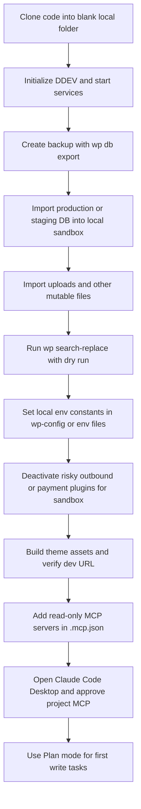

# Claude Code Desktop Workflow Research for a WordPress and WooCommerce Project

## Executive Summary

For a WordPress and WooCommerce workflow in Claude Code Desktop, the highest-value stack is not “install every popular agent repo.” The best pattern is a **thin, conservative core**: use **CodeGraph** for fast structural code navigation in PHP, Liquid, JS, TS, and related frontend languages; use **Addy Osmani’s agent-skills** for disciplined planning, implementation, testing, and review flows; use **WooCommerce for Claude** plus **Automattic’s WordPress remote MCP proxy** only against a **staging or sandbox store**; and keep **WP-CLI** as the primary mutation layer for database, config, plugin, and migration tasks. That combination aligns with Claude Code’s current plugin, MCP, permissions, desktop preview, and project-file model, while keeping data exposure and accidental writes under control. citeturn20view1turn30view0turn24view0turn31search4turn32search2turn32search5turn37view0turn38view0

From the eight candidate repositories, the strongest immediate adoptions are **addyosmani/agent-skills**, **colbymchenry/codegraph**, and selective small copies from **hardikpandya/stop-slop** and **Leonxlnx/taste-skill**. The most useful “adapt later” candidate is **Egonex-AI/Understand-Anything**, especially for onboarding or large-theme architecture reviews, but it is heavier and more token-intensive than CodeGraph for day-to-day implementation. **headroom** is promising for very large context windows and verbose logs, but it adds proxy and compression complexity that is not necessary on day one. **Agent-Reach** is useful for competitive research and public-web lookups, not as an always-on coding dependency. **Anthropic-Cybersecurity-Skills** is rich, but the full 754-skill library is too broad for a normal Woo build; cherry-picking a tiny subset is the pragmatic path. citeturn24view0turn20view1turn19view1turn16view1turn18view0turn27view0turn23view2turn21view0

Because your hosting, PHP version, local OS, deployment topology, Bedrock usage, and whether your theme is classic, block, or Sage-based are unspecified, the safest recommendation is a **DDEV-backed sandbox** with WP-CLI, a generated `.claude/launch.json` preview config, and a **project-scoped `.mcp.json`** that exposes only read-only WordPress and WooCommerce tools at first. Claude’s own docs explicitly separate project files under `.claude/`, with `CLAUDE.md` and `.mcp.json` at the repo root, and recommend project-scoped MCP servers with approval gates. Claude Desktop also stores preview-server config in `.claude/launch.json`. citeturn36search5turn36search11turn36search15turn32search12turn32search2turn32search6turn32search0

## What matters most for this workflow

A productive Claude Code Desktop setup for WordPress and WooCommerce should optimize for five things at once: **safe write control**, **fast code understanding**, **reliable local reproduction**, **store-safe data access**, and **low cognitive overhead for the model**. Claude’s current extension model is explicitly split across always-on project context in `CLAUDE.md`, on-demand skills, plugins, MCP servers, subagents, and hooks. Project-scoped MCP servers live in `.mcp.json`, while project files live under `.claude/` or at the repo root depending on file type. The desktop app adds visual diff review, integrated terminal/editor, and live app preview, with preview configuration persisted in `.claude/launch.json`. citeturn32search8turn32search12turn32search2turn32search0turn32search5

The practical implication is straightforward. For a Woo project, do **not** give Claude broad write power to production-like APIs early. Use **Plan mode** for anything that edits files or runs shell-write tools, because Claude’s permissions model routes write operations for review in planning contexts and warns that `bypassPermissions` is only appropriate in isolated containers or VMs. Configure allowed tools deliberately through `/permissions`, keep MCP servers minimal because each one consumes context, and prefer **read-only MCP** until your sandbox is stable. citeturn31search8turn31search12turn31search0turn32search6

For WordPress specifically, **WP-CLI** remains the most trustworthy mutation interface. Official WP-CLI docs cover `wp db export`, `wp db import`, `wp search-replace`, `wp config set`, `wp plugin deactivate`, and `wp core install`, all of which are ideal for scripted local-clone, staging, and reset workflows. If you are using Sage, Roots’ current documentation still centers on Composer-based installation plus Node/Vite asset builds, and DDEV’s WordPress support automatically manages `wp-config-ddev.php` and includes WP-CLI as a built-in developer tool. citeturn31search9turn35search0turn34search0turn34search1turn34search2turn34search3turn36search0turn36search3turn36search6turn36search15

## Repository assessments

### Comparison matrix

| Repository | Purpose and key files | License, runtime, dependencies | Maturity and recent activity | Security and privacy posture | WordPress/Woo applicability |
|---|---|---|---|---|---|
| **addyosmani/agent-skills** | Lifecycle skill pack with 24 skills, 7 slash commands, personas, references, `README.md`, `AGENTS.md`, `plugin.json`, and a workflow file for plugin install testing. citeturn24view0turn24view3turn40view0 | MIT. Mostly Markdown/plugin metadata; no heavy runtime dependency is surfaced in the root docs. citeturn39view0turn24view0 | Very active: recent commits on **2026-06-19**; visible issues and PRs; plugin install test workflow present. citeturn43view1turn40view0 | Low inherent data risk; biggest risk is workflow overreach if commands are wired to broad write permissions. citeturn24view0turn31search12 | **Adopt now.** Excellent for spec, plan, build, test, review discipline in WP plugin/theme work. |
| **chopratejas/headroom** | Context-compression layer for agents with library, proxy, MCP server, `Cargo.toml`, `README.md`, `SECURITY.md`, large workflow suite. Wraps Claude and other agents. citeturn16view0turn16view1turn25view0turn26view2 | Apache-2.0. Rust workspace with Python extension via `pyo3`, plus Python 3.10+ and npm package distribution; dependencies include `serde`, `tokio`, `axum`, `reqwest`, AWS/GCP auth libs. citeturn16view0turn16view1turn16view2 | Very active: recent commits on **2026-06-20**; many workflows including CI, eval, release, Docker, native E2E, wrap E2E. citeturn43view0turn25view0 | Explicitly warns not to expose the proxy publicly and notes logs may contain sensitive info. Good security policy, but operationally higher risk than pure-skill repos. citeturn26view2 | **Adapt later.** Useful if your Woo project produces huge logs, large search output, or heavy MCP context; too much complexity for phase one. |
| **Panniantong/Agent-Reach** | Internet-access CLI/skill layer for web, social, GitHub, search, RSS; includes `pyproject.toml`, `tests/`, `CLAUDE.md`, `.env.example`, `pytest.yml`, multilingual README. citeturn11view1turn17view0turn18view0turn14view0 | MIT. Python 3.10+ package using `requests`, `feedparser`, `python-dotenv`, `loguru`, `pyyaml`, `rich`, `yt-dlp`; optional `playwright`, `browser-cookie3`, `mcp[cli]`. citeturn17view0turn17view2 | Active: recent commits on **2026-06-16**; tests folder and `pytest.yml`; moderate issue/PR counts. citeturn14view0turn44view0 | Cookies remain local per README, but this repo still expands browser, cookie, and external-content exposure substantially. Security policy covers auth bypass, RCE, path traversal, SSRF, injection, and sensitive-data exposure. citeturn18view0turn26view3 | **Use only for research.** Good for competitor, docs, and public-web discovery; avoid as an always-on codebase dependency. |
| **mukul975/Anthropic-Cybersecurity-Skills** | Large security knowledge library with **754 skills**, 26 domains, mappings to ATT&CK, NIST CSF 2.0, ATLAS, D3FEND, AI RMF; includes `skills/`, `mappings/`, `tools/`, `index.json`, validation workflows. citeturn27view0turn29view0turn39view1 | Apache-2.0. Mostly structured skill content and metadata, not a heavy runtime package. citeturn39view1turn27view0 | Active enough, with 159 commits and workflows like `validate-skills.yml`, `update-index.yml`, `sync-marketplace-version.yml`. citeturn27view0turn29view0 | Low software-execution risk, but high **context-bloat** risk and possible workflow mismatch for mainstream Woo tasks. citeturn27view0turn29view0 | **Cherry-pick only.** Good source for hardening checklists and threat-model prompts; avoid wholesale import. |
| **Leonxlnx/taste-skill** | Anti-slop frontend design skill pack with many installable `SKILL.md` variants and `skill.sh` registry script. Includes implementation and image-generation skills. citeturn21view0turn21view2 | MIT. Essentially skill docs and a small Bash registry helper; no build/runtime manifest surfaced. citeturn21view1turn21view2 | Active: recent commits on **2026-06-17**; moderate issues/PRs; no visible workflow/test suite from `.github` listing. citeturn42view0turn22view0 | Low data risk; main risk is design style drift, over-complex motion, or brand inconsistency if used without project rules. citeturn21view0 | **Adopt selectively.** Strong fit for premium storefront UI, landing pages, merchandising pages, and redesign briefs. |
| **Egonex-AI/Understand-Anything** | Interactive knowledge-graph plugin/dashboard for codebases and docs; includes `.claude-plugin`, dashboard packages, tests, `package.json`, `SECURITY.md`, install scripts. citeturn11view2turn19view0turn19view1turn15view0turn26view1 | MIT. PNPM/TypeScript monorepo; uses ESLint/Vitest and tree-sitter dependencies including **tree-sitter-php**, which implies PHP parsing support. citeturn19view0turn19view2turn30view3 | Active: recent commits on **2026-06-19**; tests present; CI and homepage deploy workflows present; high issue/PR velocity. citeturn45view0turn15view0turn11view2 | Explicitly local-only in scope; security doc highlights hostile-project risks and a dashboard file-content endpoint protected by token and allowlist. Initial full analysis can consume substantial tokens; later runs are incremental. citeturn26view1turn19view1 | **Adapt for onboarding and architecture reviews.** Heavier than CodeGraph for daily implementation, but valuable for learning a large Sage/Woo codebase. |
| **hardikpandya/stop-slop** | Tiny prose-cleanup skill: `SKILL.md`, `README.md`, and reference files for banned phrases, structures, and examples. citeturn23view0turn23view2turn23view3 | MIT. Markdown-only; no runtime dependencies. citeturn23view1turn23view2 | Smaller, slower-moving project: last visible commits on **2026-03-17**; no CI or tests apparent. citeturn45view2turn23view2 | Very low technical risk. | **Adopt now.** Useful for cleaner proposal copy, issue descriptions, ADRs, changelogs, PR summaries, and product copy drafts. |
| **colbymchenry/codegraph** | Local semantic code-intelligence CLI plus MCP server; creates `.codegraph/`, auto-syncs, supports many languages including **PHP** and **Liquid**, ships tests, telemetry docs, workflows, and CLI install flow. citeturn20view0turn20view1turn11view3turn14view2turn30view0turn26view0 | MIT. Node-based package with bundled runtime option or npm; depends on `web-tree-sitter`, `tree-sitter-wasms`, SQLite-backed index; npm route requires Node `>=20 <25`. citeturn20view0turn20view2 | Active: recent commits on **2026-06-19**; tests and release workflows present; 1.0.1 package surfaced in manifest. citeturn45view1turn12view4turn14view2turn20view0 | Local-first, but anonymous telemetry is default-on at install unless disabled. No code or paths are collected according to telemetry doc. citeturn26view0 | **Adopt now.** Best direct fit for day-to-day WordPress/Woo/Sage code navigation and impact analysis. |

### Prioritized recommendation list

| Priority | Recommendation | Why |
|---|---|---|
| **Adopt now** | **CodeGraph** | Highest daily utility for PHP/Woo/Sage code understanding, impact analysis, and cheap MCP queries; supports PHP and Liquid explicitly. citeturn30view0turn20view1 |
| **Adopt now** | **Addy Osmani’s agent-skills** | Gives you a disciplined `/spec → /plan → /build → /test → /review → /ship` operating model that maps well to theme/plugin work and team QA. citeturn24view0 |
| **Adopt now** | **Stop Slop** | Tiny, safe, and useful for all human-facing artifacts in a growth/marketing-heavy Woo workflow. citeturn23view0turn23view2 |
| **Adopt selectively** | **Taste Skill** | Best when you want stronger storefront design direction, especially premium ecommerce pages, but it should not override accessibility or performance rules. citeturn21view0 |
| **Adapt later** | **Understand Anything** | Strong onboarding and architecture tool; use when someone new needs to understand a large custom codebase, not on every task. citeturn19view1turn26view1 |
| **Adapt later** | **Anthropic-Cybersecurity-Skills** | Mine a small subset for Woo security reviews, payment-flow hardening, and admin-surface audits. Do not drop all 754 skills into normal sessions. citeturn27view0turn29view0 |
| **Experiment later** | **Headroom** | Valuable if you are hitting token blowups from logs, traces, or very large MCP outputs, but too operationally heavy for the first pass. citeturn16view1turn26view2 |
| **Avoid as core install** | **Agent-Reach** | Great research layer, poor default coding dependency. Keep it user-scoped and read-mostly. citeturn18view0turn17view0 |

### Per-repo integration judgment

**Addy Osmani’s agent-skills** should be treated as your **process substrate**, not as a plugin you blindly invoke for every task. In Claude Code Desktop, the best use is to adapt a subset of its lifecycle skills and slash-command model into project rules and a few custom skills. Required connectors: none. Useful companions: GitHub, browser/devtools, WP-CLI. Recommended scope: **write-capable**, but only in Plan mode and on feature branches. Recommended placement: vendored plugin in something like `tools/vendor/agent-skills/` if you want to track upstream, plus copied project-specific derivatives under `.claude/skills/engineering/`. citeturn24view0turn32search4turn32search13

**Headroom** integrates best as a **user-scope external runtime**, not as a repo folder inside your WordPress project. It has native wrapping for Claude and exposes MCP tools, but it also introduces a proxy layer, local caches, and operational knobs. Required connectors: none, though it can sit in front of MCP-heavy flows. Adapters: usually none if you use `headroom wrap claude`, but you may want wrapper scripts for project-specific startup. Recommended scope: **read-mostly** at first. Placement: user scope outside the repo, with a short project note in `CLAUDE.md` on when to enable it. citeturn16view1turn32search2turn32search6

**Agent-Reach** should be installed only if you want Claude to do **public-web research** from within the same environment. It installs CLI tooling, may install system dependencies, can integrate Exa through MCP, and relies on browser or cookie access for some platforms. Required connectors: browser/cookie access, optional MCP/search. Adapters: wrapper commands for research tasks only. Recommended scope: **strictly read-only** relative to your project; do not grant store or filesystem write routines through it. Placement: user scope or `tools/research/agent-reach/` wrappers, not embedded into theme/plugin code. citeturn17view0turn18view0turn26view3

**Anthropic-Cybersecurity-Skills** is best used as a **reference quarry**. You do not need 754 skills in the active context for a Woo build. Required connectors: none. Adapters: simple hand-curated skills that capture the parts relevant to Woo auth, checkout, admin, secrets, and file upload surfaces. Recommended scope: **read-only** reference; only bring specific hardening tasks into write sessions. Placement: `.claude/skills/security/` with 3–8 distilled project-specific skills, not the whole upstream repo. citeturn27view0turn29view0

**Taste Skill** is a clean fit for **custom theme and storefront work**, especially homepage, PLP/PDP, campaigns, and brand-driven landing pages. Required connectors: none. Adapters: one project-specific wrapper skill that constrains motion, density, accessibility, and Woo conversion heuristics. Recommended scope: **write-capable** for frontend-only folders. Placement: `.claude/skills/design/` with one or two copied `SKILL.md` files, plus a project `DESIGN.md` or `CLAUDE.md` override. citeturn21view0turn21view2

**Understand Anything** works best as a **plugin-level onboarding and visualization tool**. Because it can analyze a whole codebase and open a dashboard, it is better for “teach me this repo” than “make a small Woo checkout fix.” Required connectors: Claude plugin system; no MCP is required for core use. Adapters: none if installed as a plugin. Recommended scope: **read-only analysis**, allowing writes only for generated graph files in `.understand-anything/`. Placement: user/plugin install, with generated graph artifacts either gitignored or selectively committed if your team wants shared onboarding assets. citeturn19view1turn26view1turn32search4

**Stop Slop** needs almost no adaptation. Required connectors: none. Scope: **read/write only in docs and prose artifacts**. Placement: `.claude/skills/writing/stop-slop/`. citeturn23view0turn23view2

**CodeGraph** is the easiest “real capability” win. It installs the CLI, wires an MCP server into Claude Code, creates `.codegraph/`, and keeps the index fresh automatically. It explicitly supports PHP and Liquid, which matters for WooCommerce templates, emails, and theme fragments. Required connectors: MCP only. Adapters: none. Recommended scope: **read-only by design**, though it writes its own local index. Placement: user-scope install plus project-local `.codegraph/` in the repo root, usually gitignored. citeturn20view1turn30view0turn32search6

## Recommended architecture and sandbox design

### Recommended project shape

For a WordPress and WooCommerce repository, I would use this layout:

```text
project-root/
  .claude/
    launch.json
    skills/
      engineering/
      security/
      design/
      writing/
    agents/
  .mcp.json
  CLAUDE.md
  tools/
    wp/
    vendor/
  wp-content/
    themes/
    plugins/
  .codegraph/
  .understand-anything/
```

This matches Claude’s project-file model: project-scoped files live under `.claude/`, while `CLAUDE.md` and `.mcp.json` live at the repository root. Claude Desktop also stores preview-server config in `.claude/launch.json`. citeturn32search12turn32search0

### Preferred sandbox stack

With hosting, PHP version, and deployment architecture unspecified, the safest default is **DDEV + WP-CLI + project-scoped MCP**. DDEV is designed for local web-development environments, supports PHP and Node.js, can auto-detect projects, and includes WP-CLI as a built-in developer tool. For WordPress specifically, DDEV manages `wp-config-ddev.php` and can import databases and files. If you are on Sage, Roots’ docs still expect Composer installation plus Node/Vite asset builds. citeturn36search11turn36search5turn36search3turn36search15turn36search0turn36search6

### Safe clone-to-sandbox workflow

Use this flow for a blank-canvas dev environment:



The operational sequence above follows the official capabilities of `wp db export`, `wp db import`, `wp search-replace`, `wp config set`, `wp plugin deactivate`, and DDEV’s project/config/import model. citeturn31search9turn35search0turn34search0turn34search1turn34search2turn36search5turn36search3turn36search16

### Concrete sandbox commands

A conservative DDEV-based bootstrap looks like this:

```bash
git clone <your-repo> my-site
cd my-site

ddev config
ddev start

# Optional if this is a fresh WP install instead of an imported one
ddev wp core install \
  --url=https://my-site.ddev.site \
  --title="My Site Sandbox" \
  --admin_user=admin \
  --admin_password=change-me \
  --admin_email=dev@example.com \
  --skip-email

mkdir -p backups
ddev wp db export backups/pre-import.sql

# If you have a dump already
ddev wp db import backups/source.sql

# Replace live URLs with local URLs; dry-run first
ddev wp search-replace 'https://www.example.com' 'https://my-site.ddev.site' --dry-run
ddev wp search-replace 'https://www.example.com' 'https://my-site.ddev.site'

# Recommended local constants or variables
ddev wp config set WP_ENVIRONMENT_TYPE local --raw
ddev wp config set WP_DEBUG true --raw
ddev wp config set WP_DEBUG_LOG true --raw

# Deactivate anything unsafe for local or staging experimentation
ddev wp plugin deactivate <outbound-email-or-payment-plugins>
```

Those commands are grounded in official WP-CLI command behavior and DDEV’s WordPress support. The exact plugin slugs, database source, and URL pairs are project-specific and therefore intentionally left unspecified. citeturn34search3turn31search9turn35search0turn34search0turn34search1turn34search2turn36search5turn36search3

### Exposing the sandbox to Claude Code

A conservative `.mcp.json` should start with **read-only WordPress and Woo** access. Claude’s docs say project-scoped MCP servers from `.mcp.json` require approval, and `claude mcp add` supports local, user, and project scopes. WooCommerce for Claude can output a Claude Code one-liner itself, but you can also wire the Automattic proxy manually. WooCommerce’s own repo recommends the proxy path for Claude Code and shows both read-only and read/write key modes; the Desktop flow auto-creates a read-only key by default and packages it into an `.mcpb` bundle. citeturn32search2turn32search6turn38view0turn38view1turn37view0

Example `.mcp.json`:

```json
{
  "mcpServers": {
    "codegraph": {
      "command": "codegraph",
      "args": ["serve", "--mcp"]
    },
    "wordpress": {
      "command": "npx",
      "args": ["-y", "@automattic/mcp-wordpress-remote"],
      "env": {
        "WP_API_URL": "https://staging.example.com/wp-json/mcp/mcp-adapter-default-server",
        "WP_API_USERNAME": "wp_readonly_user",
        "WP_API_PASSWORD": "app_password_here",
        "OAUTH_ENABLED": "false"
      }
    },
    "woocommerce-claude": {
      "command": "npx",
      "args": ["-y", "@automattic/mcp-wordpress-remote@0.3.0"],
      "env": {
        "WP_API_URL": "https://staging.example.com/wp-json/woocommerce-claude/mcp",
        "WP_API_USERNAME": "ck_readonly_key",
        "WP_API_PASSWORD": "cs_readonly_secret",
        "OAUTH_ENABLED": "false"
      }
    }
  }
}
```

This combines the official MCP proxy pattern from Automattic with WooCommerce’s documented Claude Code setup approach. Start with read-only credentials; switch to read/write only inside an isolated staging store when you actively want Claude to create or edit catalog or order data. citeturn37view0turn38view0turn38view1

Example `.claude/launch.json` for a Sage theme with Vite:

```json
{
  "previewServers": [
    {
      "name": "wordpress",
      "command": "ddev launch"
    },
    {
      "name": "sage-vite",
      "command": "cd wp-content/themes/your-sage-theme && npm run dev"
    }
  ]
}
```

Claude Desktop will auto-detect many dev-server setups and stores the preview configuration in `.claude/launch.json`, but editing it manually is supported when you need custom commands. For Sage, Roots documents `npm run dev` and `npm run build` around Vite. citeturn32search0turn36search6

## Concrete skills, agents, rules, and CLAUDE.md patterns

### Recommended skill set for this project

The best custom layer is a **small derived skill pack**, not a giant upstream dump. I would create these project skills:

| Skill | Derived from | What it should do |
|---|---|---|
| `wp-woo-safe-change` | Addy agent-skills + WP-CLI + Woo staging practice | Force spec, plan, backup, command preview, dry-run, and verification before any DB or admin mutation. citeturn24view0turn31search9turn34search0 |
| `sage-theme-workflow` | Taste Skill + Sage docs + Addy frontend/testing discipline | Constrain storefront design work to Sage conventions, Vite builds, accessibility, and performance sanity checks. citeturn21view0turn36search0turn36search6turn24view0 |
| `woo-catalog-analyst` | WooCommerce for Claude prompts/resources + CodeGraph | Combine store data, template flows, and code impact analysis before editing PDP/PLP/cart/checkout. citeturn38view3turn20view1 |
| `writing-clean-room` | Stop Slop | Clean ADRs, PRs, release notes, and merchant-facing copy. citeturn23view0turn23view2 |
| `security-checkout-review` | Anthropic-Cybersecurity-Skills subset + WP hardening | Run auth, secrets, file upload, payment, and admin-surface checks for Woo changes. citeturn27view0turn29view0 |

### Example `SKILL.md`

```md
---
name: wp-woo-safe-change
description: Use when changing WordPress or WooCommerce code, config, DB, or admin-connected behavior. Enforces backup, plan, staging-first writes, dry-run migrations, and post-change verification.
---

# WordPress and WooCommerce Safe Change Workflow

## Use this when
- Editing theme, plugin, mu-plugin, or WooCommerce integration code
- Running WP-CLI commands that mutate config, plugins, options, users, or the database
- Changing product, checkout, cart, account, or order flows
- Touching Sage assets or Vite config

## Required process
1. Restate the intended outcome in one paragraph.
2. Identify write surfaces:
   - files
   - database
   - WP options
   - Woo data
   - external APIs or webhooks
3. Propose a short plan before writing anything.
4. If the task can affect data, require:
   - `wp db export` backup
   - `wp search-replace --dry-run` before real replacement
   - read-only MCP unless the user explicitly wants remote mutations
5. Prefer WP-CLI over ad hoc SQL or wp-admin clicking.
6. Keep all changes on a feature branch.
7. After changes, verify:
   - build passes
   - relevant page flow works
   - no PHP fatals or JS console errors
   - rollback path is stated

## Refusals inside this skill
- Never mutate production Woo data from a default session.
- Never store API keys in committed files.
- Never enable write-capable MCP against production by default.

## Exit criteria
- Exact files changed are listed
- Exact commands run are listed
- Verification evidence is listed
- Rollback command or rollback file set is listed
```

This skill is a synthesis, but it is directly aligned with Addy’s lifecycle emphasis, Claude’s permission model, and WP-CLI’s safe migration commands. citeturn24view0turn31search0turn31search8turn34search0turn31search9turn35search0

### Example agent definition

```json
{
  "name": "woo-architecture-reviewer",
  "description": "Reviews WordPress and WooCommerce changes for code impact, template flow, plugin interactions, and store safety.",
  "system_prompt": [
    "Use CodeGraph first for symbol and dependency discovery.",
    "Use read-only WordPress/Woo MCP before proposing store-side edits.",
    "Prefer WP-CLI command suggestions over dashboard instructions.",
    "When the theme is Sage-based, verify Vite build and asset implications.",
    "Before recommending writes, produce a rollback-aware plan."
  ]
}
```

Claude plugins can include skills, agents, hooks, MCP servers, and related components, so this pattern fits the current product model cleanly. citeturn31search4turn32search1turn32search4

### Recommended `CLAUDE.md` snippet

```md
# Project operating rules

## Environment
- Treat this repository as a WordPress + WooCommerce codebase.
- Assume remote MCP endpoints are staging-first unless explicitly marked otherwise.
- Keep production mutations out of normal sessions.

## Preferred tools
- Code understanding: CodeGraph first, then direct file reads
- Site mutation: WP-CLI first
- Store intelligence: WooCommerce MCP on staging
- Public research: Agent-Reach only when explicitly needed

## Change policy
- For any write task, start in Plan mode.
- For DB or URL migrations, show the dry-run command first.
- For theme work, verify build and preview before declaring success.
- For storefront UX work, preserve accessibility and checkout stability over visual novelty.

## Sensitive data
- Do not print API keys, application passwords, OAuth tokens, or customer PII.
- Do not commit secrets to repo files.
- Disable telemetry in local-only tools where possible.
```

That snippet reflects Claude’s current extension boundaries, CodeGraph’s telemetry controls, and the split between MCP, skills, and always-on project context. citeturn32search8turn32search12turn26view0

## Risks, permissions, and rollout

### Risk checklist

| Risk area | What can go wrong | Recommended control |
|---|---|---|
| **Production store writes** | Product, order, coupon, or settings mutations land in the wrong environment | Use read-only MCP keys by default; only switch to read/write on isolated staging. WooCommerce for Claude explicitly supports both permission levels. citeturn38view1turn38view2 |
| **WordPress auth leakage** | Application passwords, JWT tokens, OAuth tokens, or Woo keys leak into files or chat history | Keep secrets in environment variables; use app passwords or OAuth where appropriate; never commit them. Automattic’s proxy stores OAuth tokens locally and documents token locations. citeturn37view0 |
| **Excessive MCP surface area** | Too many tools consume context and increase bad tool selection | Keep `.mcp.json` minimal; Claude docs recommend removing servers you no longer use because server instructions and tool names load into sessions. citeturn32search6 |
| **Proxy and logging exposure** | Headroom or remote MCP logs may contain sensitive content | Do not expose proxies publicly; keep staging endpoints access-controlled; review log settings. Headroom explicitly warns about proxy exposure and sensitive logs. citeturn26view2 |
| **Telemetry leakage** | Usage metadata leaves the machine unexpectedly | Disable CodeGraph telemetry immediately for client work if you want strict local-only operations. CodeGraph documents `codegraph telemetry off`, `CODEGRAPH_TELEMETRY=0`, and `DO_NOT_TRACK=1`. citeturn26view0 |
| **Hostile-repo parsing edge cases** | Code-analysis tools may be tricked by malicious files or path handling | Keep analysis on your own repos; Understand Anything explicitly calls out hostile-project concerns and path-allowlist protections. citeturn26view1 |
| **Cookie/browser overreach** | Research tools access personal or corporate browsing sessions | Use Agent-Reach only in a separate research profile and never as a default project dependency. citeturn18view0turn26view3 |
| **Context bloat** | Huge skill libraries reduce model focus | Do not install full Anthropic-Cybersecurity-Skills into normal sessions; distill only relevant Woo hardening tasks. citeturn27view0 |

### Recommended permission settings

For Claude Code Desktop, the safest initial configuration is:

| Situation | Mode | Rationale |
|---|---|---|
| Early setup, repo analysis, code understanding | **Read-focused / normal approvals** | Lets you review commands and file edits while the sandbox is still forming. citeturn31search12 |
| Planned code changes, migrations, or config edits | **Plan mode** | Claude docs say Plan mode routes file-edit and shell-write operations for review instead of auto-approval. citeturn31search8 |
| Disposable container or VM only | **bypassPermissions only if fully isolated** | Claude docs explicitly warn this mode is only for isolated environments like containers or VMs. citeturn31search0 |
| MCP servers | **Project-scoped, explicitly approved** | Project MCP from `.mcp.json` requires approval, which is a useful circuit breaker. citeturn32search2 |
| Remote WordPress/Woo servers | **Read-only first** | Avoid accidental store mutations while you validate schemas, prompts, and workflows. citeturn38view1turn38view2 |

In practice, I would keep the following `/permissions` posture: allow reads, allow CodeGraph MCP, allow local preview commands, allow WP-CLI only in Plan mode for mutating commands, and deny or require confirmation for any remote write-capable MCP action until the staging environment is verified. That is consistent with Claude’s current permissions and MCP model. citeturn31search0turn31search8turn32search2

### Migration and experimentation timeline

| Milestone | Scope | Effort | Exit criteria |
|---|---|---|---|
| **Foundation** | DDEV sandbox, WP-CLI verified, backups working, preview opens in Desktop | **Medium** | Local site boots, DB import works, `wp search-replace` verified, preview stable. citeturn36search5turn31search9turn35search0turn34search0turn32search0 |
| **Navigation layer** | Install CodeGraph, initialize `.codegraph/`, verify PHP and theme navigation | **Low** | Claude answers structural questions using CodeGraph instead of repeated grep/read loops. citeturn20view1turn30view0 |
| **Process layer** | Adapt Addy skills into project-specific `CLAUDE.md` and a few custom skills | **Low** | `/spec`, `/plan`, `/build`, `/test`, `/review` style workflow becomes repeatable in the repo. citeturn24view0turn32search13 |
| **Store intelligence** | Add Woo read-only MCP on staging, then WordPress remote MCP if useful | **Medium** | Claude can inspect catalog, analytics, and code impact without production writes. citeturn38view0turn38view3turn37view0 |
| **Frontend refinement** | Add Taste Skill wrappers and Sage-specific rules | **Low** | Homepage/PLP/PDP work follows brand, performance, and accessibility constraints. citeturn21view0turn36search6turn24view0 |
| **Advanced onboarding** | Trial Understand Anything on the largest codebase areas | **Medium** | New contributors can answer “how does this area work?” using the dashboard and saved graph. citeturn19view1turn26view1 |
| **Advanced optimization** | Optional Headroom proxy or selected security skills | **High** | Proven benefit on real tasks, with no unacceptable logging or workflow complexity. citeturn16view1turn26view2turn27view0 |

### Local commands to inspect the candidate repos

These are the commands I would run locally in a disposable workspace to inspect or validate each repo:

| Repo | Clone and inspect | Runtime or test commands to try |
|---|---|---|
| `addyosmani/agent-skills` | `git clone https://github.com/addyosmani/agent-skills.git && cd agent-skills && find skills agents references -maxdepth 2 -type f | head -200` | `grep -R "^name:" skills -n` |
| `chopratejas/headroom` | `git clone https://github.com/chopratejas/headroom.git && cd headroom && ls && find .github/workflows crates -maxdepth 3 -type f | head -200` | `cargo test --workspace` or `pip install "headroom-ai[all]"` then `headroom wrap claude` and `headroom perf` per README. citeturn16view1turn16view0 |
| `Panniantong/Agent-Reach` | `git clone https://github.com/Panniantong/Agent-Reach.git && cd Agent-Reach && find agent_reach tests docs -maxdepth 3 -type f | head -200` | `pip install -e ".[all,dev]"` then `pytest` or `agent-reach doctor`. citeturn17view0turn18view0 |
| `mukul975/Anthropic-Cybersecurity-Skills` | `git clone https://github.com/mukul975/Anthropic-Cybersecurity-Skills.git && cd Anthropic-Cybersecurity-Skills && find skills mappings tools -maxdepth 3 -type f | head -300` | `grep -R "^mitre_attack:" skills -n | head` |
| `Leonxlnx/taste-skill` | `git clone https://github.com/Leonxlnx/taste-skill.git && cd taste-skill && find skills research -maxdepth 3 -type f | head -300` | `bash -lc 'source ./skill.sh design-taste-frontend'` to resolve the selected `SKILL.md`. citeturn21view2 |
| `Egonex-AI/Understand-Anything` | `git clone https://github.com/Egonex-AI/Understand-Anything.git && cd Understand-Anything && find understand-anything-plugin tests docs -maxdepth 3 -type f | head -300` | `pnpm install && pnpm test` or plugin install followed by `/understand`. citeturn19view0turn19view1 |
| `hardikpandya/stop-slop` | `git clone https://github.com/hardikpandya/stop-slop.git && cd stop-slop && find . -maxdepth 2 -type f` | No runtime needed; inspect `SKILL.md` and `references/*.md`. citeturn23view0turn23view2 |
| `colbymchenry/codegraph` | `git clone https://github.com/colbymchenry/codegraph.git && cd codegraph && find src __tests__ docs -maxdepth 3 -type f | head -300` | `npm install && npm test`, then `codegraph install` and `codegraph init` in your project. citeturn20view0turn20view1 |

If you want the **first concrete commands** to run against your own WordPress repo rather than the upstream repos, these are the highest-value ones:

```bash
# inside your project
ddev start
ddev wp db export backups/before-claude-setup.sql
codegraph install
codegraph init

# root files
touch CLAUDE.md .mcp.json
mkdir -p .claude/skills/{engineering,security,design,writing} .claude/agents

# if Sage
cd wp-content/themes/your-sage-theme
npm install
npm run build
```

Those commands create the safe baseline that the rest of the workflow depends on. citeturn36search5turn31search9turn20view1turn36search0turn36search6

## Open questions and limitations

Several environment decisions were unspecified, so the recommendations above intentionally stay conservative: whether you use **Bedrock**, the actual **PHP version**, whether your store is **single-site or multisite**, whether you have a **true staging environment**, which **payment/email/search plugins** are installed, and whether your theme is **Sage, block, or classic PHP templates**. Those details will change the exact sandbox commands and the right MCP scope, but they do **not** change the overall conclusion: start with **CodeGraph + Addy-style workflow discipline + WP-CLI + read-only Woo/WordPress MCP** and add heavier repos only after the sandbox is stable. citeturn20view1turn24view0turn31search1turn37view0turn38view0turn32search2